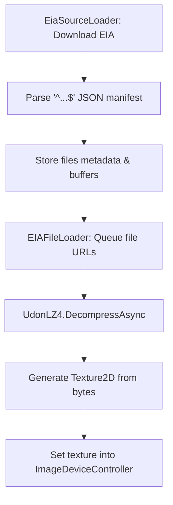

# EIA v1 (Efficient Image Archive v1)

`ImageDeviceController` から扱うことができる、画像シーケンス向けの拡張フォーマットです。  
TextZip v1 をベースにしつつ、差分エンコーディングと LZ4 圧縮を組み合わせることで、スライドや UI スクリーンショットなど「フレーム間の変化が少ない」画像列を高効率に格納します。

より詳細な仕様・実装ガイドは、[ImageDeviceController リポジトリの EIA v1 仕様書](https://github.com/o-tr/imageslide-converter/tree/master/docs)を参照してください。

## 基本構造

EIA v1 ファイルは、以下の構造を持つバイナリフォーマットです。

```
[ヘッダー (マニフェスト)] [圧縮データブロック...]
```

- 先頭には `^` と `$` に挟まれた JSON マニフェストが配置されます。
- その直後から、1 つ以上の LZ4 圧縮された画像データブロックが連結されます。

`ImageDeviceController` 側では、`EiaSourceLoader` がダウンロードしたバイナリから `^...$` の範囲を取り出して JSON としてパースし、残りのバイト列を画像データとして扱います。

## マニフェストの概要

マニフェストは JSON オブジェクトで、その中の `i` フィールドに「ファイル一覧」が格納されます。

```typescript
type EIAManifestV1 = {
  t: "eia";        // フォーマット識別子
  c: "lz4";        // 圧縮方式
  v: 1;            // バージョン番号
  f: string[];     // 機能配列（例: ["Format:RGB24"]）
  e: string[];     // 使用する拡張（例: ["note"]）
  i: EIAFileV1[];  // ファイル項目の配列
}
```

### ファイル項目 (EIAFileV1)

各ファイルは、マスター画像（`t: "m"`）か、他の画像を参照するクロップ画像（`t: "c"`）として記述されます。

```typescript
type EIAFileV1Base = {
  t: "m" | "c";        // "m": マスター, "c": クロップ
  n: string;           // 識別子（名前）
  f: string;           // テクスチャフォーマット（TextureFormat 文字列）
  w: number;           // 元画像の幅
  h: number;           // 元画像の高さ
  s: number;           // データセクション内の開始オフセット
  l: number;           // 圧縮データ長
  u: number;           // 非圧縮データ長
  e?: {                // オプションの拡張オブジェクト
    note?: string;
    [key: string]: string;
  };
}

type EIAFileV1Master = EIAFileV1Base & {
  t: "m";
};

type EIAFileV1Cropped = EIAFileV1Base & {
  t: "c";
  b: string;               // ベース画像（マスター）の識別子
  r: EIAFileV1CroppedPart[]; // クロップ矩形の配列
};

type EIAFileV1CroppedPart = {
  x: number;  // ベース画像上での X 座標
  y: number;  // ベース画像上での Y 座標
  w: number;  // 矩形の幅
  h: number;  // 矩形の高さ
  s: number;  // 非圧縮データ内での開始オフセット
  l: number;  // バイト長
};
```

`ImageDeviceController` の `EiaSourceLoader` は、この `i` 配列を順に読み取り、各ファイルのメタデータとバッファを内部キャッシュに格納します。

## 読み込みフロー（ImageDeviceController 観点）

`ImageDeviceController` では、主に次の 2 つのコンポーネントが EIA v1 の処理を担当します。

- `EiaSourceLoader`  
  - EIA ファイルをダウンロードし、マニフェスト (`^...$`) 部分を抽出・パースします。
  - `i` に含まれる各ファイルの情報と、その圧縮バッファを内部配列（`EiaParsedFileUrls` / `EiaParsedFileBuffers` / `EiaParsedFileManifests`）に格納します。
- `EIAFileLoader`  
  - 表示優先度に応じてファイル URL をキューイングし、`UdonLZ4` を用いて LZ4 解凍を行います。
  - 解凍結果と `r`（クロップ矩形）の情報から最終的なピクセル配列を組み立て、`Texture2D` を生成して `ImageDeviceController` 内のキャッシュに保存します。

処理の流れを簡略化すると、次のようになります。



## TextZip v1 との関係

- **コンテナ**:
  - TextZip v1 は ZIP + JSON マニフェストを使うフォーマットです。
  - EIA v1 は独自バイナリコンテナ + JSON マニフェスト + LZ4 圧縮で構成されます。
- **用途**:
  - TextZip v1 は静的な画像群をまとめる用途に向いています。
  - EIA v1 は「前後フレームの差分が小さい」スライド・UI・アニメーションシーケンスなどに最適化されています。
- **互換性 / 移行**:
  - 既存 TextZip v1 を利用している場合でも、新規コンテンツを EIA v1 で配信することでサイズ削減や読み込み体験の改善が見込めます。

